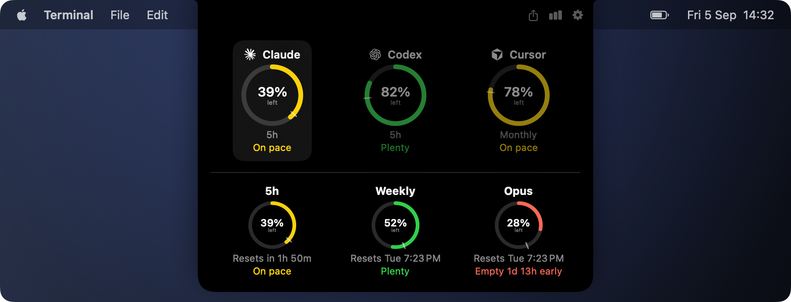
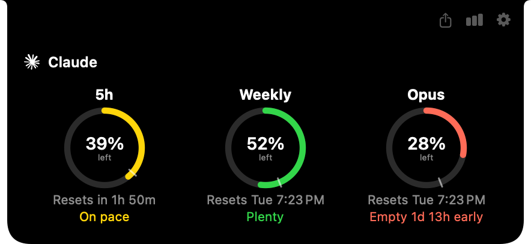
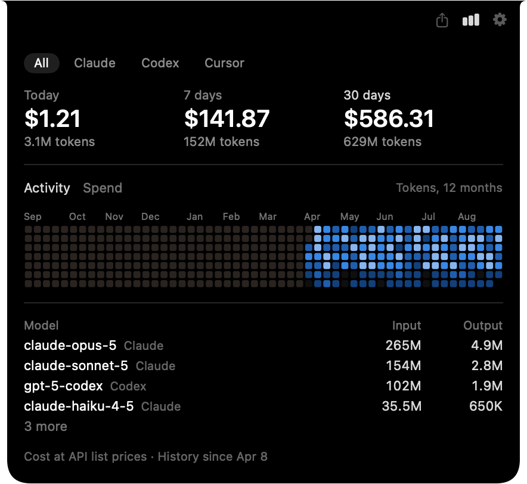
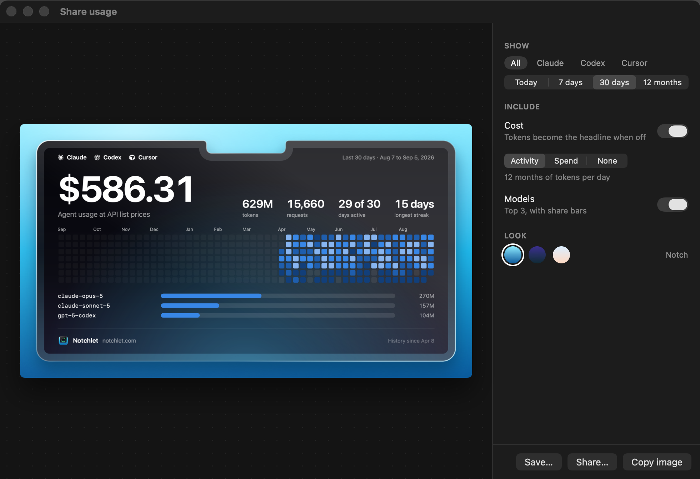
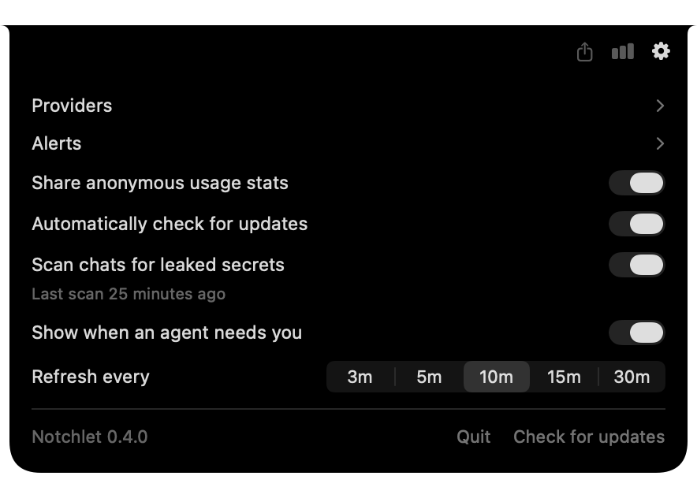
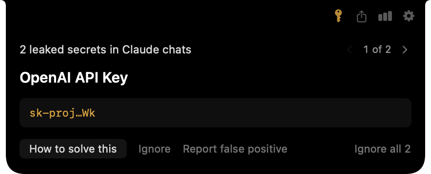
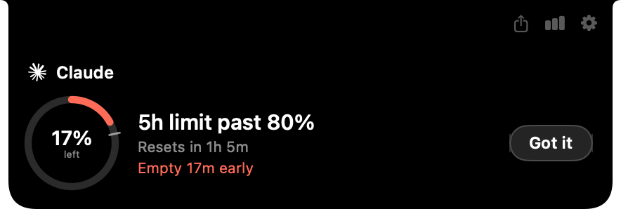
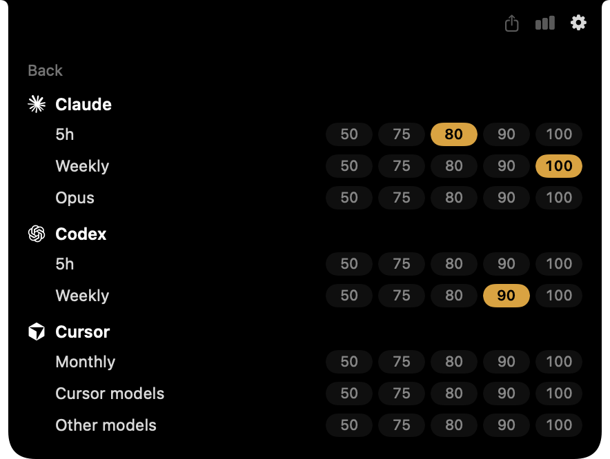
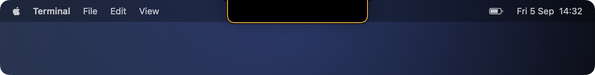

<div align="center">



<h1>Notchlet</h1>

<p><b>Your agent limits, in the notch.</b><br>
Hover the notch to see how much of your Claude Code, Codex, Cursor and OpenCode limits is left, and what you used and spent over the past year. It also tells you when a limit passes a mark you set, when an agent is waiting on you, and when a key leaked into a chat.</p>

<p>
<a href="https://github.com/SiebeBaree/Notchlet/actions/workflows/ci.yml"></a>

<a href="LICENSE"></a>
</p>

</div>

## Install

<a href="https://github.com/SiebeBaree/Notchlet/releases/latest"></a>

Or with Homebrew:

```sh
brew install --cask SiebeBaree/tap/notchlet
```

Or build it yourself:

```sh
git clone https://github.com/SiebeBaree/Notchlet.git
cd Notchlet
./Scripts/fetch-betterleaks.sh
open Notchlet.xcodeproj
```

macOS 14 or newer. A Mac without a notch gets a virtual one at the top of the screen. Updates arrive through Sparkle: an icon shows up in the notch, nothing pops up.

## Supported agents

<div align="center">

</div>

Notchlet reads the limits from the same endpoints the CLIs read them from, with the login the CLI already has on your Mac. Fetching a limit never spends any of it. Up to three providers show at once; installed ones are on by default.

| Provider | Signs in with | Limits |
| --- | --- | --- |
| Claude Code | Its keychain item, or its credentials file | 5h, weekly, per-model weekly |
| Codex | Its `auth.json` | Whatever your ChatGPT plan gets |
| Cursor | Cursor.app's own state, or a session token you paste | Monthly, plus the Cursor models and other models pools |
| OpenCode | The key `/connect` saved, or a key you paste | OpenCode Go: 5h, weekly, monthly |

Pick the login per provider in its settings page. Anything you paste goes into Notchlet's own keychain item.

Adding a provider is one file. See [CONTRIBUTING.md](CONTRIBUTING.md).

## Features

### Usage view



One gauge per limit, showing what is left. The tick on the track is where you would be at an even burn. The verdict under it says whether you run out before the reset, and by how much. With two or three providers active each gets one gauge, hover one to unfold its limits.

### Historic view



Cost and tokens for today, the last 7 days and the last 30 days. A year of activity with each day's models on hover, or the last 30 days of cost per day. Every model with its input and output tokens. Filter by provider with the chips, or click a gauge in the usage view to jump straight to that provider.

### Share view



The share icon turns the historic view into a PNG. Pick the period, whether it leads with cost or tokens, the activity grid or the spend line, the models, and one of three looks. Copy it or save it.

### Settings



Everything lives in the notch, there is no settings window. Providers and their logins, notifications, analytics, updates, the secret scanner, the agent line and how often to refresh.

### Secret scanning



Agents see a lot of keys. Notchlet scans your Claude Code and Codex chats for them on your Mac and opens the notch when it finds one, with the kind of key and enough characters to recognise it. Ignore it, report a false positive, or follow the link to rotate it.

### Notifications



Pick 50, 75, 80, 90 or 100 percent on any limit. When a refresh finds the limit past that mark the notch opens by itself. Once per cycle, and it waits until you are back at the Mac.



The other notification is a line around the notch. Blue means an agent finished, amber means it is asking you something.



It goes away when you hover the notch, when you switch back to the terminal or editor that runs the agent, or when the agent gets its next prompt. It never shows when that app is already in front.

## How it works

**The notch.** Notchlet is an AppKit agent app with one borderless panel over the notch and no dock icon. Collapsed, that panel is sized to the notch itself, so moving the mouse anywhere else never reaches the app and costs nothing. Hovering grows the window and the SwiftUI card animates out of the notch shape.

**Limits.** Every provider is one file that names its endpoint, its login options and how to map the response into limits. Claude Code's limits come from the endpoint behind `/usage`, Codex's from the one behind `/status`, Cursor's from the endpoint its dashboard uses, OpenCode's from the OpenCode Go usage endpoint. The store polls every 10 minutes while the notch is closed (3 to 30 in settings) and every 60 seconds while it is open, with 30 seconds between attempts and exponential backoff on a 429.

**Logins.** Keychain items are read by spawning `/usr/bin/security`, the same tool the CLIs wrote them with, so macOS never asks for your keychain password. Cursor's token is read from its `state.vscdb` with `sqlite3` in read-only mode. The one token Notchlet ever refreshes is Claude Code's, and only after it expired: it takes Claude Code's own lock files, re-reads, refreshes and writes back exactly as Claude Code does, so a running Claude Code is never signed out.

**Pace.** The verdict is the average burn since the limit's window started, the same model CodexBar uses. No verdict is given until 8% of the window has passed, so a burst right after a reset does not read as "empty in minutes". Nothing is stored between refreshes.

**History.** Each CLI already logs every request: Claude Code's transcripts, Codex's session rollouts, OpenCode's message database and Cursor's usage export. Notchlet rolls those into one row per day and model. JSONL logs are read in 256 KiB chunks and remembered by size and modification date, so a re-read only touches the appended bytes. Claude Code deletes transcripts after 30 days, so every finished day is sealed into Notchlet's own archive under Application Support and only today and yesterday are recomputed. Cost is what the same tokens would cost at API list prices, from a bundled table; a model the table does not know is named, never priced at zero. Logs are read five seconds after launch, then hourly, on wake, and when the view opens onto data older than a minute.

**Share.** The PNG is the same SwiftUI view as the preview, rendered at 2x to 2400 by 1350 pixels. Nothing in it uses a blur or a material because there is no window behind an offscreen render, so the glass is painted from gradients.

**Secrets.** [betterleaks](https://github.com/betterleaks/betterleaks) ships inside the app, pinned by version and checksum. It runs at background priority with high confidence only, the first time after the Mac has been idle for two minutes and is cool, then hourly over the files that changed. A finding is stored as a hash of the secret plus its first six and last two characters, so a key pasted in forty chats is one finding and the secret itself is never written down. Placeholders, bare variable names and expired JWTs are dropped. The scanner never checks a key against anyone's API. Apple silicon only, since the binary is arm64.

**Notifications.** A rule is a provider, a limit and a percentage. Rules are checked on every successful refresh the store already does, and each fires once per cycle, keyed by the limit's reset time. Rules and unacknowledged notifications persist, so a relaunch neither loses nor repeats one. The notch opens for twelve seconds, deferred until your next mouse move if you were away.

**The line.** Notchlet writes a two-line shell script to `~/.notchlet/hook` and registers it in each CLI's own hook config: `~/.claude/settings.json`, `~/.codex/hooks.json`, `~/.cursor/hooks.json` and an OpenCode plugin file. The script pipes the hook payload into a Unix socket with `nc`. Notchlet works out which terminal or editor launched the agent from the bundle id macOS puts in every GUI-launched process's environment, and clears the line when that app comes to the front. Turning the setting off removes exactly those hook entries. The line is a stroked `CAShapeLayer` with a Core Animation fade, so the collapsed notch keeps its zero CPU.

**Analytics and updates.** Anonymous PostHog events, a random id and things like "the notch was opened". The complete list of what leaves the machine is one file, [`AnalyticsEvent.swift`](Notchlet/Analytics/AnalyticsEvent.swift). Usage numbers, credentials and findings are never in it. One toggle turns it off, and builds from source send nothing. Updates come from Sparkle over a signed appcast on GitHub Pages.

## License

[MIT](LICENSE)
