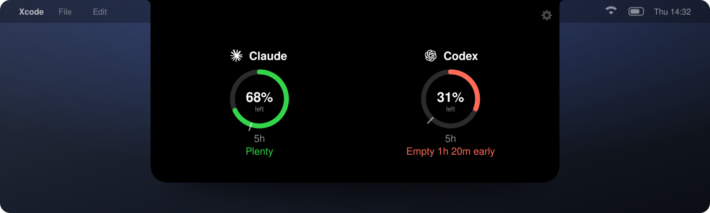
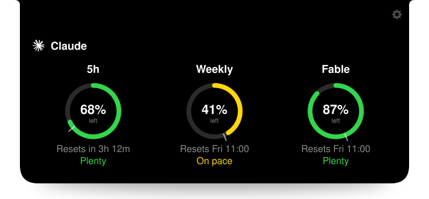

<div align="center">



<h1>Notchlet</h1>

<p><b>Your agent limits, in the notch.</b><br>
Hover the top of your Mac and see how much Claude Code and Codex usage you have left.</p>

<p>
<a href="https://github.com/SiebeBaree/Notchlet/releases/latest"></a>
</p>

<p>
<a href="https://github.com/SiebeBaree/Notchlet/actions/workflows/ci.yml"></a>


<a href="LICENSE"></a>
</p>

</div>

## What it is

If you run coding agents all day, you hit a wall you cannot see. Claude Code and Codex both cap you per rate-limit window, and both bury the number inside the CLI. Claude Code puts it behind `/usage`, Codex behind `/status`. You have to open a terminal session and ask.

Notchlet moves that number to the one place you already look. It lives in the notch, shows nothing until you hover, then slides open with what is left and whether you are burning it too fast.

No dock icon. No menu bar clutter. No window to manage.

## What the numbers mean

<div align="center">

</div>

Every rate-limit window gets a ring.

- **The percentage** is how much of that window you have left, not how much you burned.
- **The small tick** on the track marks where you would be at an even burn. Ring ahead of the tick means you are under pace. Behind it means you are ahead of schedule in the bad way.
- **The verdict** turns that into a sentence. `Plenty`, `On pace`, or `Empty 1h 20m early` so you know how much runway you actually lose.

Run two or three agents and each gets a summary gauge. Hover one to unfold its full breakdown.

## Install

```sh
brew install --cask notchlet
```

Or [download the latest release](https://github.com/SiebeBaree/Notchlet/releases/latest), drag it to Applications and open it. Then look at the top of your screen and hover.

Notchlet needs macOS 14 or newer. A notch is optional. On a Mac or external display without one, it draws a virtual notch at the top center of the screen.

### Build from source

```sh
git clone https://github.com/SiebeBaree/Notchlet.git
cd Notchlet
open Notchlet.xcodeproj
```

Run the `Notchlet` scheme in Xcode 26 or newer.

## Supported agents

| Agent | Reads | Windows |
| --- | --- | --- |
| Claude Code | The endpoint behind `/usage` | 5h session, weekly, per-model weekly |
| Codex | The endpoint behind `/status` | Whatever your ChatGPT plan gets |

At most three run at once. Toggle them in the settings behind the gear.

Adding an agent is one file. See [CONTRIBUTING.md](CONTRIBUTING.md).

## Privacy

Notchlet reads the credentials the CLIs already wrote to your machine and calls the same usage endpoints the CLIs call. Nothing else.

- It never spends usage to measure usage.
- It never refreshes your tokens. Rotating a refresh token behind the CLI's back can log you out of it, so an expired login means no data until you run that CLI again.
- Your usage numbers, credentials and account never leave your Mac.

Notchlet does send anonymous product analytics, a random UUID plus events like "the notch was opened". The full list of what leaves the machine is one file, [`AnalyticsEvent.swift`](Notchlet/Analytics/AnalyticsEvent.swift). Turn it off with one toggle in settings. Builds from source send nothing at all.

## License

[MIT](LICENSE)
